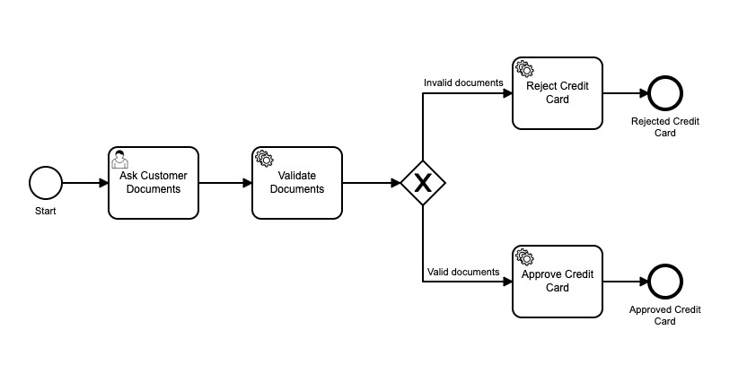

# Camunda - Dummy journey

## Project
This is a study project to practice the development of [Camunda](https://docs.camunda.org/manual/latest/) based applications.
To be more interesting, this project simulates a credit card applicant journey in which the user inputs documents to sign up for a credit card.

This project contains three modules:
- Engine
- CreditCardProposal
- ValidateDocuments

Each application has only one purpose and are developed to be reusable in order to simulate real-world scenario
in which external tasks are architected to be plugged in different BPMNs with ease.

### Engine
This application runs [Camunda](https://docs.camunda.org/manual/latest/) engine only.

### CreditCardProposal
This application is an [external task](https://docs.camunda.org/manual/latest/user-guide/process-engine/external-tasks/) that process approved and rejected credit card proposals.

### ValidateDocuments
This application is an [external task](https://docs.camunda.org/manual/latest/user-guide/process-engine/external-tasks/) that validates the documents provided and outputs true or false based on validation result.
